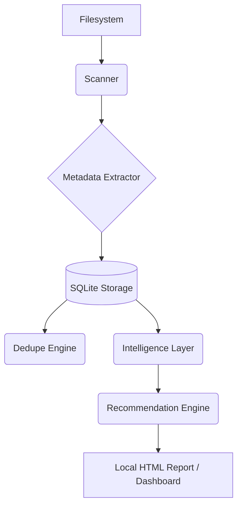

# Digital Exhaust Cleaner

Digital Exhaust Cleaner is a sophisticated, privacy-centric analysis engine designed for local filesystem optimization. It provides a secure environment to identify and manage redundant data, abandoned projects, and digital clutter without compromising user privacy.

## Executive Summary

As digital workspaces expand, they accumulate "digital exhaust"—a collection of duplicate files, temporary downloads, and forgotten assets that consume storage and obscure important data. Digital Exhaust Cleaner addresses this challenge through advanced local analysis, providing clear, actionable recommendations for storage reclamation while ensuring all data remains on the user's local hardware.

## Architecture



## Core Capabilities

*   **Secure Local Analysis**: Operates entirely within the local environment. Metadata extraction and analysis are performed without external network dependencies, ensuring total data sovereignty.
*   **Intelligent File Classification**: Utilizes heuristic analysis and perceptual hashing to identify exact duplicates, near-duplicate imagery, and behavioral clutter signals.
*   **Transparent Decision Support**: Offers an explainable recommendation system. Each suggestion is accompanied by a rationale, allowing users to make informed decisions about their data.
*   **Safety-First Operations**: Implements a reversible cleanup workflow. Files are moved to a secure quarantine rather than being immediately deleted, providing a fail-safe against data loss.
*   **Interactive Management Dashboard**: Provides a comprehensive interface for reviewing scan results, managing duplicates, and executing cleanup tasks.

## Privacy and Security

Privacy is the foundational principle of this project. Unlike traditional storage optimization tools that may leverage cloud-based processing, Digital Exhaust Cleaner performs all computations locally. 

*   **Zero Cloud Exposure**: No file content or metadata is transmitted to external servers.
*   **Immutable History**: Maintains a local log of all actions for auditability and restoration.
*   **Open Source Transparency**: The underlying logic is open for inspection, ensuring no hidden telemetry or tracking.

## Getting Started

### Prerequisites

Digital Exhaust Cleaner requires the Go runtime (version 1.22 or higher).

### Installation

Clone the repository and initialize the dependencies:

```powershell
git clone https://github.com/local/digital-exhaust-cleaner
cd digital-exhaust-cleaner
go mod download
```

### Basic Usage

To perform a standard analysis of a directory:

```powershell
go run ./cmd/app scan --path "C:\Users\Target\Path" --report reports/analysis.html
```

To launch the interactive management dashboard:

```powershell
go run ./cmd/app serve --path "C:\Users\Target\Path" --addr 127.0.0.1:8787
```

---
